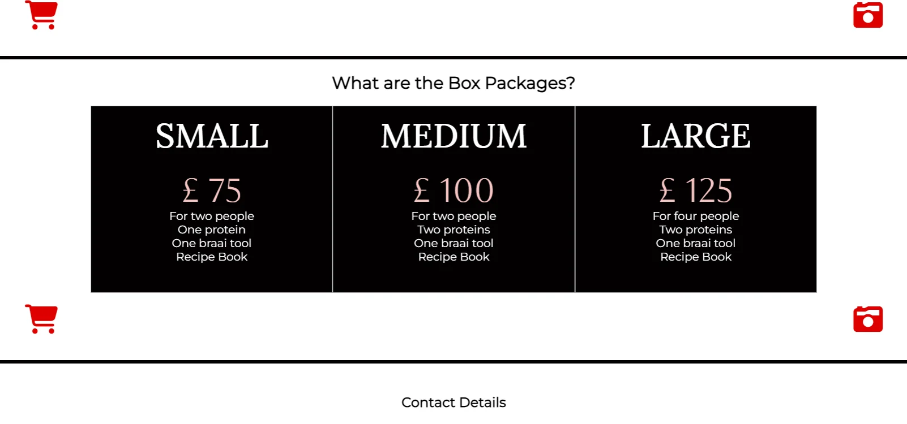

# Braai Gifting Co

Braai Gifting Co is a fictional online retailer that specializes in selling barbecue gift packages. The company aims to design an attractive website that embodies its brand essence, "Give the gift of braai and create lasting memories," targeting people who love to barbecue. The website features a static and responsive design created using HTML and CSS, with the aim of providing a stress-free shopping experience for customers.

The website includes the following pages:

1. Landing page
2. Photo gallery
3. Order form

This website is the first of five projects that need to be completed in order to receive a diploma in Software Development from The Code Institute.

A live version of the project can be found here: https://blignaut24.github.io/Project_One-Braai_Gift_Co_Website/

## Table of Content

------

------

## User Experience (UX)

### User Demographic

This website is intended for:

- Individuals who frequently buy barbeque products and want a stress free online experience.
- Individuals searching for a unique gift.
- Individuals who buy meat online.

### User Stories

As a user/ potential customer of this website:

- I must be able to understand within five seconds what this website is about and how it will satisfy my barbecue needs.
- Quickly learn and understand what braaing is.
- Understand what products and services are offered and how to order them.

#### Desktop

#### Mobile

### Design

The design objective for the Braai Gifting Co website was to create a clean and simplistic layout that conveyed a sense of luxury. The website aimed to provide a stress-free shopping experience for customers looking for unique barbecue gift packages. The color scheme, fonts, and images were carefully selected to reinforce the brand message of luxury and simplicity while being easy to read and visually appealing. The website included features such as a navigation bar, icon container bar, box package menu, footer, gallery page, and order form, all aimed at improving user accessibility and navigation.

#### Colors

The color selection for this website was inspired by the barbecue theme and is listed in the table below.

| Color Code | Name  | Color Semantics      |
| ---------- | ----- | -------------------- |
| #ffffff    | White | Background           |
| #020000    | Black | Text                 |
| #bc0000    | Red   | Call-to-Action (CTA) |
| #892a1c    | Red   | Tab hover            |
| ##fcc3c2   | Pink  | CTA hover            |
| #74747c    | Grey  | Filler               |

### Typography

The selection of the fonts reinforce the brand message of luxury and simplicity while being easy to read. 

| Font         | Font Semantics |
| ------------ | -------------- |
| Montserrat   | Text           |
| Lora         | Headings       |
| Hind Madurai | Tabs           |
| Aboreto      | Logo           |

## Features

### Existing Features

#### Navigation Bar

- The navigation bar is located on every page of the website and serves as the primary navigation panel.

- Each button on the navigation bar provides user feedback and accessibility when hovered over.

- The navbar's simplistic design makes it very intuitive for the user to use.

  

  

### Icon Container Bar

- Icon container bar is the secondary navigation panel.
- It is only found on the landing page at the end of each section.
- The bar only contain internationally recognized icons to help improve user accessibility.

### Box Package Menu

- The change in format help draw user attention.

- The price is the only text in red (#f4c2c1), which helps prioritize information and improves readability.

  

### Footer

- The footer is present on every page of the website, and it is fully responsive.
- No text-only icons are used in the footer to help improve accessibility and user navigation.
- The icon provide buttons connect to social media sites where the company it registered and opens up in a new tab.

### Gallery Page

- The gallery page contains no text, except for the header and footer.
- This improves user accessibility, especially for those with visual impairments or language barriers.

### Order Form

- Typeform was chosen due to the large amount of information that needs to be captured in a business transaction.

- This can be overwhelming and often provides the user with an unpleasant experience.

- Using Typeform, the questions were presented in a visually friendly way.

- It also helps prevent inaccurate client data by providing feedback to the user if the information required by the business is incorrect.

  

  

  ## Features Left to Implement

  - When a user hovers over them, the icons in the icon container bar change.
  - Introducing a video on landing page demonstrating the product.
  - Add more photos of satisfied customers, meals, and outdoor events to the gallery page.

  

  ## Technologies used

  ### Language Used

  - HTML5
  - CSS3

  ### Frameworks, Libraries & Programs Used

  - [Visual Studio Code:](https://code.visualstudio.com/)
    - VS code was used as a Integrated Development Environment (IDE).
  - [Chrome DevTools:](https://developer.chrome.com/docs/devtools/)
    - Chrome DevTools was used to consistently check the site in terms of design output (html, css).
  - [Google Chrome:](https://www.google.com/intl/en_uk/chrome/dr/download/?brand=YTUH&gclid=Cj0KCQjwl8anBhCFARIsAKbbpyTVJMjZOaUUknZ3woPPaqI7zs1N7bSbiecK3h-vgJXNajHFR1KRtXMaArYnEALw_wcB&gclsrc=aw.ds)
    - Google Chrome was used as my primary web browser.
  - [Firefox:](https://www.mozilla.org/en-GB/firefox/new/?utm_medium=paidsearch&utm_source=google-rsa&utm_campaign=fxeu&utm_content=A144_A203_302582&gclid=EAIaIQobChMI_LeGhoqJgQMVQ4hQBh3zygbPEAAYASAAEgKXTPD_BwE)
    - Firefox was used as secondary web browser for testing purposed.
  - [Polypane:](https://polypane.app/)
    - Polypane was used a multi-page browser to see how their website looks across different devices and screen sizes simultaneously.
  - [Coolers:](https://coolors.co/cfcfcf-545f66-f18805-d95d39-581f18)
    - Coolers website used for generating color schemes.
  - [Am I Responsive:](https://ui.dev/amiresponsive)
    - Am I Responsive takes mockup screenshots of various breakpoints for my [README.md](http://readme.md/) file.
  - [Typeform:](https://www.typeform.com/)
    - Typeform is a platform for creating online forms and surveys with a focus on user experience.
  - [Figma:](https://www.figma.com/community/tag/landing%20page/files)
    - Figma is a web-based design and prototyping tool that I used for the wireframes.

  

  ## Testing

  The website's functionality has been tested, and the results are shown in the following tables. Each section of the website has been tested according to its respective feature, and tests have been conducted using the following tools on various devices and screen resolutions:

  - Google DevTools
  - Polypane
  - Firefox

###  	Media Breakpoint Table

​	The guidelines for CSS media breakpoints were compiled  from various sources, listed in the Credits section of the  README file, 	to create a table of the most commonly used  breakpoints worldwide. The default code is written using a mobile-first approach, with 	a width of 320px.

​	**World Wide Popular Screen Sizes:**

| Resolution | Device            | Percentage of Usage |
| ---------- | ----------------- | ------------------- |
| 360x640    | Extra-Extra-Small | 7.28%               |
| 375x667    | Extra-Small       | 3.75%               |
| 414x896    | Small             | 4.58%               |
| 1366x768   | Extra-Large       | 8.44%               |
| 1536x864   | Extra-Extra-Large | 3.88%               |
| 1920x1080  | Extra-Extra-Large | 8.89%               |

### 	Project Media Breakpoint Settings:

| Resolution             | Device            |
| ---------------------- | ----------------- |
| 481 x767               | Small             |
| 768 x 1024 (portrait)  | Small -Medium     |
| 768 x 1024 (landscape) | Large             |
| 1025 x 1280            | Large             |
| 1281 x higher          | Extra-Extra-Large |

### 	

### Navigation Bar

| Feature             | Expect                                                       | Action                                   | Result |
| ------------------- | ------------------------------------------------------------ | ---------------------------------------- | ------ |
| Logo                | When the logo is clicked it will return the user to the home page | Clicked logo                             | Pass   |
| Gallery nav button  | When clicked it will direct the user to the gallery page in the same tab | Clicked gallery nav button               | Pass   |
| Order nav button    | When clicked it will direct the user to the order form in the same tab | Clicked order nav button                 | Pass   |
| Nav menu responsive | Website is responsive to multiple different screen sizes     | Resized browser on multiple screen sizes | Pass   |

### 	

### Footer

| Feature              | Expect                                               | Action                                     | Result |
| -------------------- | ---------------------------------------------------- | ------------------------------------------ | ------ |
| Footer icon links    | Link are not broken                                  | Click on each footer icon on all the pages | Pass   |
| Footer is responsive | Footer responsive to multiple different screen sizes | Footer browser on multiple screen sizes    | Pass   |

### 	

### Landing Page

| Feature               | Expect                                               | Action                                   | Result |
| --------------------- | ---------------------------------------------------- | ---------------------------------------- | ------ |
| Text is responsive    | Text responsive to multiple different screen sizes   | Resized browser on multiple screen sizes | Pass   |
| Images are responsive | Images responsive to multiple different screen sizes | Resized browser on multiple screen sizes | Pass   |

### 	

### Gallery Page

| Feature                       | Expect                                               | Action                                   | Result |
| ----------------------------- | ---------------------------------------------------- | ---------------------------------------- | ------ |
| Gallery images are responsive | Images responsive to multiple different screen sizes | Resized browser on multiple screen sizes | Pass   |

### Order Form

| Feature                  | Expect                                                       | Action                                                       | Result |
| ------------------------ | ------------------------------------------------------------ | ------------------------------------------------------------ | ------ |
| Order form validation    | Error messages will appear if the form is submitted without all fields filled, a correct email and the checkbox checked | Submit form without any input                                | pass   |
| Order form submit button | Form submits when the submit button is clicked               | Clicked the submit button on the form                        | pass   |
| Order form responsive    | Form should be responsive on all screen sizes                | Resized browser and checked form on different screen resolutions | pass   |

## Validator Testing

**HTML**

No errors were found when the site was passed through the official [W3C Validator](https://validator.w3.org/nu/?doc=https%3A%2F%2Fleoniemclaughlin7.github.io%2FVincent-Van-Gogh%2F) using the URL input format.

### CSS

The site passed through the official [Jigsaw validator](https://jigsaw.w3.org/css-validator/validator?uri=https%3A%2F%2Fleoniemclaughlin7.github.io%2FVincent-Van-Gogh%2F&profile=css3svg&usermedium=all&warning=1&vextwarning=&lang=en) without any errors when using the input format.

### Lighthouse Testing

## **Known Bugs**

Below is a list of known bugs in the website.

| Bug                                                      | Status | Solution                                              |
| -------------------------------------------------------- | ------ | ----------------------------------------------------- |
| Gallery page footer did not stick to button of the page. | fixed  | Modified sample code from the "Stick Footer" article. |

## **Development and Deployment**

The site was deployed to GitHub pages. The steps to deploy are as follows:

1. Navigate to GitHub.
2. Choose the desired GitHub repository.
3. Select settings from the top menu bar.
4. On the left hand side, under the code and automation section, choose pages.
5. Under the build and deployment heading, set branch as main and click save.
6. The website will deploy, a link to the project will be seen at the top of the page.

## Content

The website content is original.

## Credits

- Media Breakpoint Table:
  - [Screen Size Map](https://screensizemap.com/)
  - [Browse Stack](https://www.browserstack.com/guide/what-are-css-and-media-query-breakpoints)
- Sticky Footer Article:
  - https://philipwalton.github.io/solved-by-flexbox/demos/sticky-footer/

## Acknowledgements

This site was developed as a third portfolio project for the Code Institute course in Full Stack Software Development. I would like to thank the following for all of the support throughout the development phase.

- The Code Institute community, including fellow students and staff.
- The Code Institute tutor team.

Johann Jurgens Blignaut 2023

*"Omnis gloria Deo"*